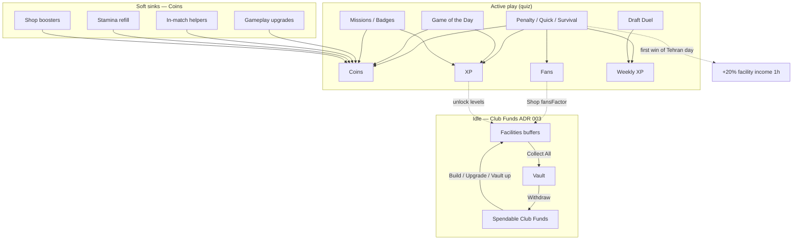

# Footballica — Game Economy (living doc)

- **Status:** Current as of 2026-08-02
- **Authority:** Implementation in code + `GameConfig` defaults; design decisions in [ADR 003](./adr/003-club-tycoon-economy-phase-a.md)
- **Related:** [ADR 001](./adr/001-game-mode-vs-format-and-daily-mystery.md) (modes / GotD), [ADR 002](./adr/002-campaign-and-grid-pillars.md) (campaign / grid)

This document describes **all currency systems**, **sources & sinks**, **runtime flows**, **Live-Ops knobs**, and **what has already shipped**. Numbers below are **defaults** from `lib/game/economy.ts` — Admin CMS may override them at runtime via the `GameConfig` singleton.

---

## 1. Design principles

1. **Server-authoritative.** Client may preview; never submit amounts. Actions send intent only (`upgradeKey`, `facilityKey`, `packTier`, kick log for verify).
2. **One pure math module per layer.** Same formulas run on server settle and client preview (`lib/game/economy.ts`, `lib/club/businessEconomy.ts`, `lib/club/upgrades.ts`, `lib/club/stamina.ts`).
3. **Do not merge currencies.** Match coins never fund business builds; Club Funds never buy helpers or refill stamina.
4. **Lazy idle math.** No per-user income cron. Accrual is settled on collect / upgrade / withdraw / snapshot read.
5. **Active vs idle balance target.** Roughly **60–70% progression pressure from play**, **30–40% from Club Funds** (see ADR 003). Early upgrades must not be payable from 24h idle alone.
6. **Tycoon never buffs competitive fairness.** No Funds spend that changes duel timers, removes options, or alters ranked scoring. Soft links only (fans → Shop rate, first-win income boost).

---

## 2. Resource map

| Resource | Storage | Product name | Role |
|----------|---------|--------------|------|
| **Coins** | `Club.coins` | Coins | Match / GotD / shop soft currency |
| **XP → Player Level** | `User.xp` (+ cached `User.managerLevel`) | Player Level | Unlocks facilities, cosmetics, flags |
| **Weekly XP** | `User.weeklyXp` | Weekly XP | Leaderboard ranking |
| **Fans** | `Club.fans` | Fans | Prestige; Club Shop income factor |
| **Stamina** | `Club.stamina` / `maxStamina` | Energy | Match / duel entry gate; regenerates |
| **Club Funds (spendable)** | `Club.clubFunds` | Club Funds | Build / upgrade business + vault |
| **Vault balance** | `Club.vaultBalance` | Vault | Holding tank after Collect |
| **Boosters (inventory)** | `boosterFiftyFifty`, `boosterFreezeTimer` | Boosters | Pre-bought match consumables |
| **Newspaper Event** | `ActiveBooster` row | Daily news | Temporary match reward multiplier |

**UI rule:** Always say **Player Level**, never “Manager Level” (Staff hire comes later).

---

## 3. Architecture overview



---

## 4. Active (quiz) economy

### 4.1 Entry cost — Stamina

| Mode | Default cost | Where |
|------|--------------|--------|
| Penalty / Quick | 1 (typical start path) | Match start / resolve path |
| Survival | `survival.staminaCost` (1) | Settled on survival settle |
| Draft Duel | `duel.staminaCost` (1) | `startDuel` deducts on open |

- Regen: passive on read via `lib/club/stamina.ts` using `lastStaminaUpdate` + Medical level.
- Capacity: `maxStamina` raised by **Training Ground** upgrades (+1 stamina grant on upgrade).
- Instant refill: `costs.staminaRefill` coins (default **100**) → full stamina.

### 4.2 Classic match rewards — Penalty / Quick

**Math:** `computeMatchRewards(kickLog, config)` in `lib/game/economy.ts`  
**Settle:** `actions/resolveMatch.ts` (re-derives log server-side; deducts helpers; applies badges/missions).

| Line | Default | Notes |
|------|---------|--------|
| XP per goal | `baseXp` = 10 | |
| Win XP bonus | `winBonus` = 50 | Majority goals |
| Combo | up to `comboMultiplier` = 1.5 | Scales XP + coins |
| Coins on win | `coinsPerWin` = 20 | 0 on loss |
| Perfect bonus | `perfectBonus` = 10 | All kicks scored |
| Fans per goal | `fansPerGoal` = 5 | |
| Fans win bonus | `fansWinBonus` = 10 | |
| Level-up grant | `levelUpCoins` = 100 | + stamina refill on level-up |

**Tutorial match:** fixed payout `{ coins: 100, xp: 20, fans: 10 }` — booster-free — so FTUE can afford first gameplay upgrade.

**Net coins on settle:**

```text
+ match coins (+ combo)
+ badge reward coins
+ mission drip coins (if any on settle path)
+ level-up coins
− helper spend (validated ≤ pre-match balance)
```

XP also increments `User.weeklyXp` for the leaderboard.

### 4.3 In-match helpers (coin sinks)

Paid live during a question; costs from `config.helpers`; re-checked in `resolveMatch`.

| Helper | Default cost | Effect |
|--------|--------------|--------|
| Hint (Pundit) | 20 | Remove 1 wrong option |
| Extra Time | 20 | +`extraTimeMs` (5000) |
| VAR 50/50 | 40 | Remove 2 wrong options |
| Reroll | 50 | Swap question |

Shop also sells inventory boosters (`boosterFiftyFifty`, `boosterFreezeTimer`) via `costs.booster*`.

### 4.4 Survival

Config slice `survival.*`. Per-correct coins/XP/fans + cleared bonuses; weekly XP ≈ `floor(score / weeklyXpDivisor)`. Stamina spent on settle.

### 4.5 Draft Duel

- **Sink:** stamina on `startDuel`.
- **Source (v1):** winner gets `duel.winWeeklyXp` (default **3**) weekly XP — **not** match coins.
- Turn timeout: `turnHours` (24h); policy `timeoutAction` = `SHADOW_BOT` | `AUTO_FORFEIT`.
- Special rounds (Memory / Tiki-Taka / etc.) gated by `liveModes.*.duel`.

Retention surface (shipped): **Duel inbox** — your-turn count, deep link to `/play/duel/[id]`, banner on Play + Club Hub, BottomNav toast → top duel.

### 4.6 Game of the Day (GotD)

Config slice `gotd.*`. Magical Player / Grid / Star Path / Memory rotation.

- Direct grants to `Club.coins` + `User.xp` (+ weekly XP).
- Streak: `streakMultiplierPerDay` (0.1 → +10% coins per streak day).
- Perfect clear flat coin bonus: `perfectClearBonusCoins` (25).

### 4.7 Missions, campaign, badges

- Mission / chest claims: coins + XP (`actions/missions.ts`).
- Achievements / badges: one-shot coins + XP snapshotted on unlock; applied in match settle and some GotD paths.
- Record challenges / campaign chapters: progression pillar (ADR 002); rewards via challenge definitions.

### 4.8 Daily Newspaper

Once per calendar claim → temporary `ActiveBooster` that multiplies match rewards while `expiresAt > now`. Soft retention drip, not a second wallet.

---

## 5. Soft sinks & IAP (Coins)

### 5.1 Gameplay upgrades (Club Hub)

Defined in `lib/club/upgrades.ts` — **paid with Coins**, not Club Funds.

| Track | Effect | Base cost → growth | Max |
|-------|--------|--------------------|-----|
| Stadium | Hub visual / fans story | 100 × 1.8^L | 4 |
| Medical | Faster stamina regen | 80 × 1.7^L | 4 |
| Training Ground | +maxStamina (+1 stamina on upgrade) | 120 × 1.9^L | 4 |

Actions: `actions/upgradeClub.ts`, shop upgrade path in `actions/shop.ts`.

### 5.2 Shop

- Stamina refill, booster packs, gameplay upgrades — **Coins**.
- Mock IAP coin packs: `lib/game/coinPacks.ts` (SMALL 500 / MEDIUM 1200 / LARGE 3000) → `PurchaseLog` + credit coins. Rate-limited (`MAX_COIN_PACKS_PER_DAY`).

### 5.3 Admin grants

`actions/admin/economy.ts` can grant coins for support / testing.

---

## 6. Idle economy — Club Funds (ADR 003 Phase A) ✅ shipped

### 6.1 Money pipeline

```text
Facility buffer (storedAmount ≤ storageCap)
    → Collect / Collect All  →  Vault (vaultBalance ≤ vaultCap)
    → Withdraw               →  Spendable clubFunds
    → Build / Upgrade facility or upgrade vault
```

- **Vault full:** stop accepting new collect into vault (no burn). Copy explains income pauses until withdraw.
- **Withdraw gate (Phase A):** Safe → Bank only when `vaultBalance >= vaultCap`. Partial drip withdraw is blocked (server + UI). Phase B finance manager may relax this.
- **UX:** primary CTA = Collect All; Withdraw appears only when Safe is full; show time-to-vault-full.

### 6.2 Facilities

| Key | Unlock (Player Level) | Default build | Notes |
|-----|----------------------|---------------|--------|
| `TICKET_OFFICE` | 1 | **0** (free) | Teaches the loop |
| `CLUB_SHOP` | 3 | 500 | `rate *= fansFactor(fans)` |
| `MUSEUM` | 5 | 2500 | Flat rate in Phase A; trophy % later |

Each built facility has `level`, `storedAmount`, `lastCalculatedAt`, `version` (optimistic lock).

### 6.3 Lazy accrual

```text
elapsed = now - lastCalculatedAt
generated = ratePerHour × (elapsed / 1h) × incomeBoost
storedAmount = min(storageCap, storedAmount + generated)
```

- Rate/cap grow with level (`rateGrowth`, `capGrowth`, `costGrowth`).
- Shop fans factor: `1 + min(shopFansBonusCap, fans / shopFansDivisor)` (cap 0.5, divisor 2000).
- **First win of Tehran day** (non-tutorial): grants `businessBoostExpiresAt` for `firstWinBoostMs` (1h) at `1 + firstWinBoostBonus` (1.2×). Applied in settle/preview rates. Fields: `Club.businessBoostExpiresAt`, `lastBusinessBoostAt`.

### 6.4 Vault

- Levels 1–5; capacity = aggregate facility rate × `vault.capHours[level-1]` hours (defaults: 3 / 6 / 8 / 12 / 24).
- Upgrade cost from `vault.baseCost` × `vault.costGrowth^(level-1)`.

### 6.5 FTUE / seed

- On business unlock: grant `businessEconomy.seedFunds` (default **150**) spendable Funds.
- Ticket Office available/free build so new clubs are not soft-locked.

### 6.6 Server actions

`actions/club/business.ts`:

- `collectFacilities(key | "ALL")`
- `withdrawVault()`
- `buildFacility(key)` / `upgradeFacility(key)`
- `upgradeVault()`

All inside DB transactions; settle-at-old-rate before upgrade; client never sends amounts.

### 6.7 Hub UI

`components/club-hub/BusinessPanel.tsx` — buffers, vault chip (≥80% urgency), boost banner, Collect All / Withdraw / build-upgrade.

---

## 7. Live-Ops & Admin

**Source of truth for tunables:** `GameConfig` merged by `mergeGameConfig` over `DEFAULT_GAME_CONFIG`.

**Admin UI:** `/admin/config` → `EconomyConfigPanel`

| Tab | Contents |
|-----|----------|
| Live Ops | Featured levers (theme, featured rewards, seed/boost highlights) |
| Match / rewards / helpers | Classic match economy |
| Survival | Survival soft economy |
| Duel | Turn hours, stamina, weekly XP, memory timers, matchmaking |
| GotD | Mystery / Grid / Star Path / Memory payouts + streak |
| Club Biz | Seed Funds, first-win boost, vault hours L1–5, shop fans, facility rates/costs/unlocks |

Malformed DB config cannot brick the game — merge always fills defaults.

---

## 8. Key code map

| Area | Path |
|------|------|
| Config + match reward math | `lib/game/economy.ts` |
| Config load / persist | `lib/game/gameConfig.ts` |
| Coin packs | `lib/game/coinPacks.ts` |
| Gameplay upgrades | `lib/club/upgrades.ts` |
| Stamina regen | `lib/club/stamina.ts` |
| Club Funds math | `lib/club/businessEconomy.ts` |
| Facility bootstrap | `lib/club/businessService.ts` |
| Match settle | `actions/resolveMatch.ts` |
| Business actions | `actions/club/business.ts` |
| Shop / refill / IAP | `actions/shop.ts` |
| Duel start / inbox | `actions/duel/startDuel.ts`, `actions/duel/getInboxCount.ts` |
| Admin economy panel | `components/admin/EconomyConfigPanel.tsx` |
| Hub business UI | `components/club-hub/BusinessPanel.tsx` |
| Duel inbox UI | `components/duel/DuelInboxBanner.tsx` |
| Prisma models | `Club`, `ClubFacility`, `GameConfig`, `PurchaseLog`, `MatchHistory`, … |
| Migrations (Funds) | `prisma/migrations/20260802120000_add_club_business_economy/` |
| Migrations (boost) | `prisma/migrations/20260802123000_add_business_income_boost/` |

---

## 9. End-to-end player loops

### Loop A — Match Day (active)

```text
Spend stamina → play mode → resolveMatch
  → coins / XP / fans / weekly XP
  → optional badge + mission coins
  → optional first-win business boost
  → spend coins on helpers / upgrades / refill
  → reopen Hub
```

### Loop B — Club Tycoon (idle)

```text
Away from app → buffers fill (lazy)
  → open Hub → Collect All → Vault
  → Withdraw → clubFunds
  → Build / Upgrade Ticket Office → Shop → Museum
  → upgrade Vault when near cap
```

### Loop C — Social async (duel)

```text
Spend stamina → matchmaking → attack/defend turns
  → inbox / toast when your turn
  → winner weekly XP
  → return via deep link `/play/duel/[id]`
```

### Loop D — Daily engagement

```text
GotD clear → coins/XP (+ streak)
Newspaper claim → temporary reward multiplier
Missions / campaign → claim coins/XP
```

---

## 10. Hard rules (do / don’t)

| Do | Don’t |
|----|-------|
| Credit Funds only from facilities (+ future tiny play bonuses) | Credit match coins into vault/funds as normal payout |
| Stop accrual when vault full | Burn overflow |
| Settle buffer before upgrade | Trust client-submitted balances |
| Use Tehran day for “first win” boost gate | Let Funds change duel fairness |
| Tune via Admin `GameConfig` | Hardcode one-off balances in UI components |

---

## 11. Work shipped (changelog)

### Phase — Core quiz economy (pre–Club Funds)

- [x] Coins / XP / fans / stamina on `Club` + `User`
- [x] `computeMatchRewards` + `resolveMatch` settle (helpers, tutorial grant, level-up)
- [x] Gameplay upgrades: Stadium / Medical / Training Ground (coin sinks)
- [x] Shop: refill, boosters, mock IAP packs + `PurchaseLog`
- [x] Survival soft economy via `GameConfig.survival`
- [x] Draft Duel: stamina entry, weekly XP win reward, timeouts / shadow bot
- [x] GotD payouts (Mystery / Grid / Star Path / Memory) + streak
- [x] Missions / badges / newspaper booster
- [x] Admin Live-Ops economy panel (match, duel, GotD, survival)
- [x] Leaderboard weekly XP

### Phase — Club Tycoon Phase A (ADR 003)

- [x] Dual currency: Coins vs Club Funds + Vault
- [x] Models: `Club.clubFunds|vaultBalance|vaultLevel`, `ClubFacility`, enums
- [x] Pure math module + server actions (collect / withdraw / build / upgrade / vault)
- [x] Lazy accrual; vault stop-not-burn; optimistic `version`
- [x] Facilities: Ticket Office / Club Shop / Museum
- [x] Seed Funds + free Ticket Office FTUE path
- [x] Hub `BusinessPanel` (Collect All, withdraw, upgrade UX)
- [x] Fans → Club Shop rate factor
- [x] Admin **Club Biz** tab (seed, vault hours, facility tunables)

### Phase — Retention polish on business + duel

- [x] First win of Tehran day → +20% facility income for 1h (`businessBoost*`)
- [x] Grant wired in `resolveMatch`; shown on result + Hub banner
- [x] Vault ≥80% urgency chip / copy
- [x] Facility level-tier visuals on Hub
- [x] **Duel inbox:** enriched items (status, action attack/defend, deadline), stronger banner CTA, Match Day urgent badge, BottomNav toast deep-links to top duel, en/fa copy

### Phase — Bank modal + sponsored interest

- [x] Bank chip opens immersive sheet (spendable Funds)
- [x] Optional sponsored bank (e.g. Saman) — opt-in / opt-out
- [x] Lazy % interest on Bank balance (`floor`, min balance, per-tick cap, catch-up limit)
- [x] Admin Club Biz: names, %, interval hours, costs, enable flag
- [x] Never credits match coins; no interest mint cron

### Club Staff (ADR 004 Phase B) ✅

- [x] Shared staff pool (avatars + rate %) — not per-facility specialist trees
- [x] Hire / assign / bench / fire (`ClubStaff`)
- [x] Assigned staff: rate bonus + lazy auto-collect when buffer full
- [x] Treasurer (hired): Safe → Bank withdraw anytime
- [x] Hub chip + staff sheet + facility desk row
- [x] Admin knobs: enabled, maxHired, hireCostBase/Growth, offerCount

### Explicitly not shipped (later)

- [ ] Out-of-app notifications (duel your-turn, vault nearly full)
- [ ] Museum trophy % multipliers
- [ ] Stadium → Ticket Office capacity link
- [ ] Milestone branch upgrades (speed vs warehouse vs premium)
- [ ] Sponsor Office as a broader system (beyond bank branding)
- [ ] Competitive buffs from Funds (forbidden by design)
- [ ] Income minting cron (forbidden — notify-only cron OK later)

---

## 12. Default number cheat-sheet

Useful when balancing without opening Admin:

| Knob | Default |
|------|---------|
| Coins / win (classic) | 20 |
| Perfect bonus | 10 |
| XP / goal | 10 |
| Win XP | 50 |
| Combo cap | 1.5× |
| Level-up coins | 100 |
| Stamina refill | 100 coins |
| Helper hint / time / 50/50 / reroll | 20 / 20 / 40 / 50 |
| Duel weekly XP win | 3 |
| Duel / survival stamina | 1 |
| GotD mystery win | 40 coins / 30 XP |
| Business seed Funds | 150 |
| Ticket Office rate L1 | 40 Funds/h · 2h buffer |
| Club Shop rate L1 | 80 Funds/h · fans factor |
| Museum rate L1 | 100 Funds/h |
| First-win boost | +20% for 1h |
| Vault cap hours L1–5 | 3 / 6 / 8 / 12 / 24 |

---

## 13. How to change balance safely

1. Prefer **Admin → Config →** relevant tab (persists `GameConfig`).
2. For structural rules (new currency, new sink class), update this doc + ADR first, then schema.
3. After code default changes in `DEFAULT_GAME_CONFIG`, existing DB rows keep old values until Admin saves or merge fills only **missing** keys — verify Live-Ops state in staging.
4. Never invent a second client-only price table.

---

## 14. Suggested next product steps (economy-adjacent)

Documented for planning; not commitments:

1. **Re-engagement:** duel your-turn + vault-nearly-full notifications (PWA / SMS / Telegram).
2. **Museum trophies:** badge taxonomy → rate multipliers.
3. Dogfood pass: Staff + Safe-full withdraw — confirm hire costs and Treasurer feel fair.
4. Stadium → Ticket capacity link / branch milestones (later).
